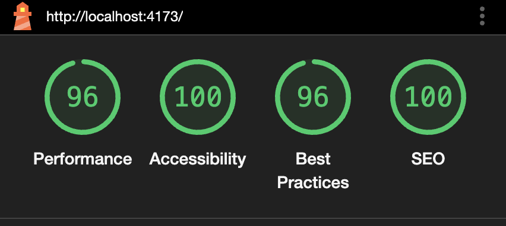
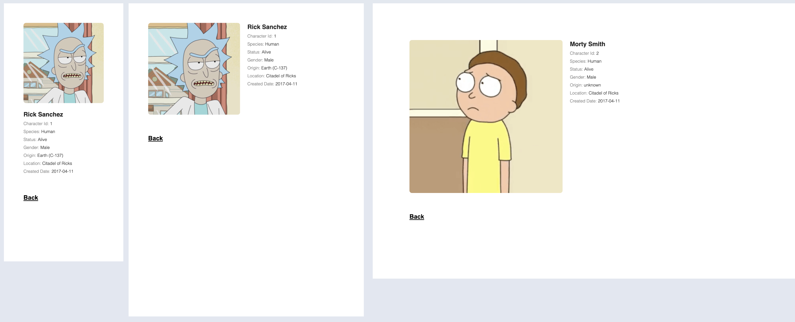
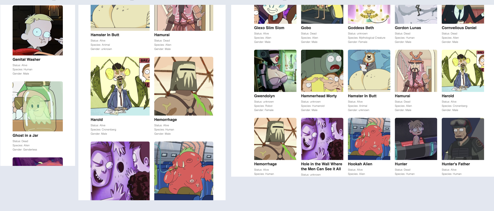

## Setup:

1. Clone the app:
```
git clone https://github.com/Imantz/rick-and-morty.git
```

2. Change to the `rick-and-morty` directory:

```
cd rick-and-morty
```

3. Install dependencies

```
npm install
```

4. This step can be skipped (a fallback `VITE_RICK_AND_MORTY_API_BASE_URL` is already provided):

``` 
cp .env.example .env
```

### Run Development:

1. Start the development server:
```
npm run dev
```

2. Open the URL: http://localhost:5173/

### Create Build and Serve Static Build:

1. Build the app:
```
npm run build
```

2. Serve the build:
```
npm run preview
```

Then click the URL (or copy and paste it into the browser): http://localhost:4173/


### Lighthouse Score:
(Tested on Chrome (Incognito) on macOS.)




⚠️ **Warning:** Tested only on Chrome(macOS). There may be bugs on other browsers.



